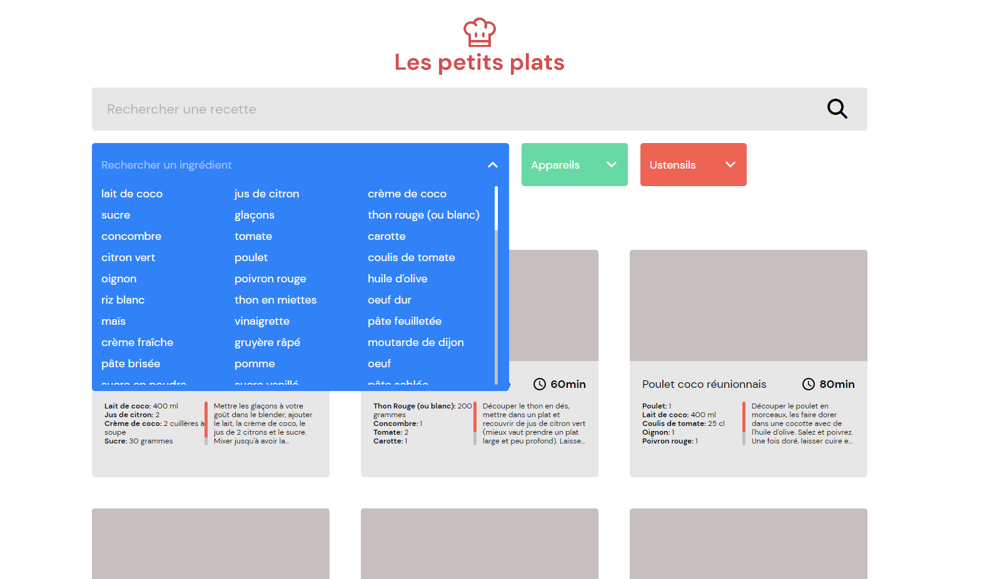

# Les-Petits-Plats-OCR

Project de formation chez OpenClassRoom.

Langage solicité:

- HTML
- CSS
- SASS
- JAVASCRIPT

# Objectif

- Développez un algorithme de recherche en JavaScript

# Maquette

[Canevas](https://www.figma.com/file/xqeE1ZKlHUWi2Efo8r73NK)

# Visiter

[Voir le Rendu](https://nerion-1337.github.io/Les-Petits-Plats-OCR/)

# Aperçu

